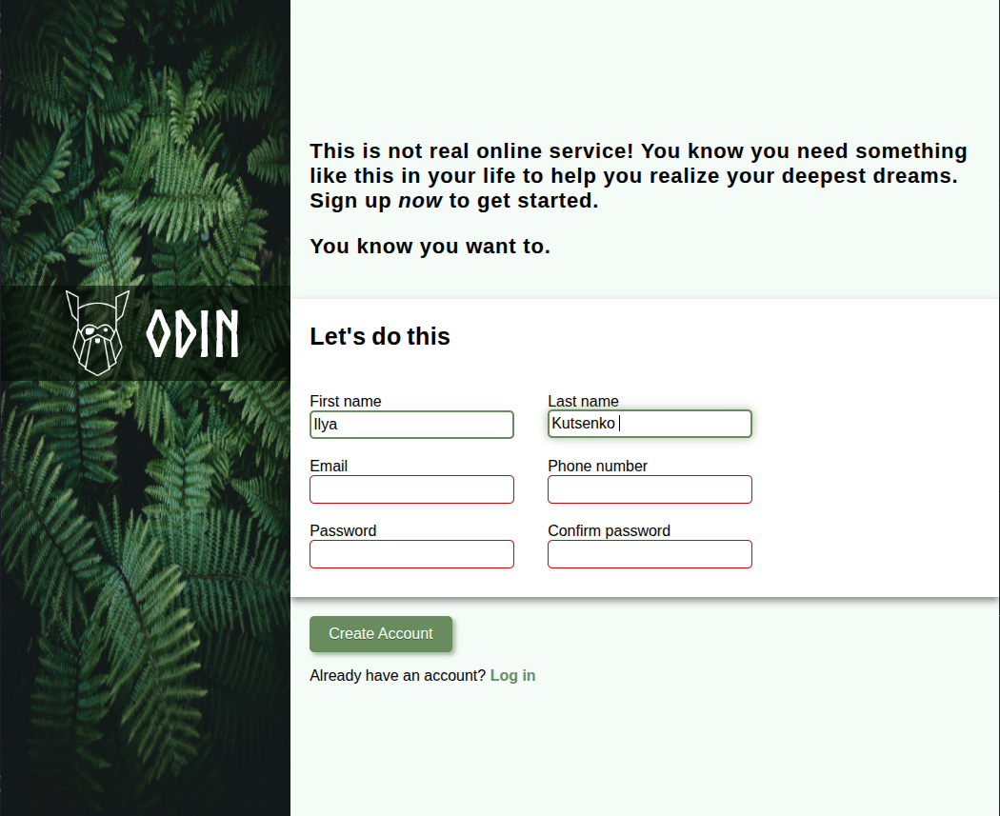

# Registration Form Project



## Table of Contents

- [Project Overview](#project-overview)

- [Features](#features)

- [Installation](#installation)

- [Usage](#usage)

- [Technologies Used](#technologies-used)

- [File Structure](#file-structure)

- [Credits](#credits)

## Project Overview

This is a registration form interface for an imaginary service called "Odin". The design features a visually striking split layout with a full-width background image on the left and a clean, functional form section on the right. The project demonstrates modern CSS techniques including Flexbox layout, custom fonts, form validation styling, and interactive elements.

## Features

- **Split-screen layout** with full-width background image

- **Semi-transparent logo banner** with custom "Norse Bold" font

- **Form validation** with visual feedback:

  - Green border for valid inputs

  - Red border for invalid inputs

  - Focus effects with subtle animations

- **Interactive elements**:

  - Button hover and active states

  - Link hover effects

  - Input focus animations

- **Password requirements**:

  - 8-12 characters

  - At least one uppercase letter

  - At least one lowercase letter

  - At least one number

## Installation

To run this project locally, follow these steps:

1. Clone the repository:

```bash

git clone https://github.com/LIGECT/registration-form.git

```

2. Navigate to the project directory:

```bash

cd registration-form

```

3. Open the project in your browser:

- Double-click the `index.html` file, or

- Use a live server extension in your code editor

## Usage

1. Fill in the registration form fields:

   - First Name (required)

   - Last Name (required)

   - Email (required, valid email format)

   - Phone Number (required)

   - Password (8-12 characters with uppercase, lowercase, and number)

   - Confirm Password (must match password)

2. Observe the validation feedback:

   - Fields turn green when valid

   - Fields turn red when invalid

   - Fields show glow effect when focused

3. Submit the form using the "Create Account" button

## Technologies Used

- **HTML5** - Semantic markup

- **CSS3** - Styling and layout

  - Flexbox for responsive layout

  - Custom fonts via `@font-face`

  - Pseudo-classes (:hover, :active, :focus, :valid, :invalid)

  - Box model properties

  - RGBA for transparency effects

- **Fonts**:

  - Norse Bold (custom font)

  - Roboto (fallback: Arial, sans-serif)

  - Comic Sans MS (for headings)

## File Structure

```

sign-up-form/

├── assets/

│   ├── fonts/

│   │   └── Norse-Bold.otf

│   └── images/

│       ├── background.jpg

│       ├── logo.png

│       └── preview.png

├── index.html

├── README.md

└── style.css

```

## Credits

- **Background Image**: [Unsplash](https://unsplash.com/photos/a-close-up-of-a-green-plant-with-lots-of-leaves-0B1Sf1eImY8)

- **Odin Logo**: [The Odin Project](https://www.theodinproject.com)

- **Norse Bold Font**: [Free Fonts](https://cdn.statically.io/gh/TheOdinProject/theodinproject/efdc2888072f409e687d31dc580595dbe4fe0ff4/app/assets/fonts/Norse-Bold.otf)

- **Design Inspiration**: The Odin Project Curriculum

---

_Note: This is a frontend-only demonstration. Form submissions are sent to a test server (httpbin.org) for demonstration purposes only._
